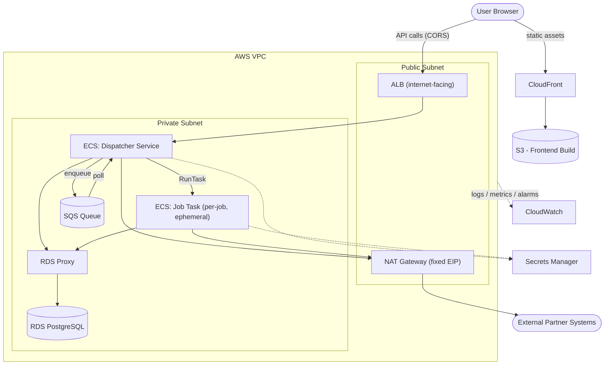

# Current State

* Single repo containing a React frontend, a Python backend, and deployment bash scripts.
* Runs on EC2 VMs on AWS, with a PostgreSQL RDS database and S3 object storage.
* Deployment is manual, via SSH.
* No CI/CD, no IaC, no centralized logging, and minimal monitoring (AWS dashboards only).
* Load spikes occur when large clients run expensive tasks, causing slowdowns and occasional downtime due to:
  * High memory usage in the application, leading to swap thrashing.
  * High database load when writing hundreds of thousands of rows.

# System Diagram

Solid arrows are request/data flow, dashed arrows are secrets access and observability. See the sections below for the reasoning behind each piece.

# Proposal

## Compute: Migrate to ECS (Fargate)

Migrating the backend off EC2 VMs to **ECS on Fargate**, managed via Terraform, rather than Kubernetes (self-managed or EKS). The React frontend does not need to run on ECS at all — see **Frontend Hosting** below for why.

**Why not Kubernetes:**

Today's system, once the frontend is served statically, comes down to a single backend service plus the dispatcher's on-demand tasks (see **Backend: Task Dispatcher**). Standing up a Kubernetes cluster to run that isn't justified by the workload; it brings meaningful complexity and cost that isn't offset by any real benefit at this scale. Even EKS (AWS-managed control plane) doesn't remove this overhead, the add-ons required just to make the cluster usable in production still need to be deployed and maintained:

* An ingress/load balancer controller (e.g. AWS Load Balancer Controller) to expose services.
* CoreDNS and CNI networking.
* A node autoscaler (e.g. Karpenter, or the more limited Cluster Autoscaler) to scale EC2 capacity, unless also paying the added per-pod cost of Fargate on EKS.
* A GitOps/deploy controller (e.g. Argo CD) so deploys aren't manual.

That's a non-trivial platform to build and operate for two services, on top of the EKS control plane cost itself.

**Why ECS on Fargate:**

* No cluster or node layer to manage, Fargate runs containers directly, so there's no EC2 fleet to patch, size, or scale at the node level.
* Native, built-in service autoscaling (target-tracking on CPU/memory/request count), no extra autoscaler component needed.
* Deploys, task definitions, and scaling policies are all managed as plain Terraform resources, keeping infra and app deploys in one consistent IaC workflow.
* Meaningfully cheaper and simpler to operate than EKS at this scale, while still providing autoscaling, rolling deploys, and AWS-native integration (ALB, IAM roles per task, CloudWatch).

**When to revisit:** if the system grows into many more independently-deployed services, or needs capabilities Kubernetes offers natively (e.g. complex multi-service traffic policies, a large platform team to operate it), EKS becomes worth reconsidering. At today's scale, ECS/Fargate accomplishes everything required at a fraction of the cost (operational and actual).

## Frontend Hosting: S3 + CloudFront

**Assumption:** the requirements only say "a React frontend," with no mention of Next.js or server-side rendering. Reading that as a plain React SPA (Create React App/Vite-style) rather than a framework that renders per-request — `npm run build` produces a static bundle (`index.html` + JS/CSS), and the browser does all the rendering; there's no per-request server-side work for the frontend itself. If it turns out to be Next.js with SSR, this section wouldn't apply and the frontend would need a compute layer like the backend does.

**Proposal:** serve the static bundle directly from **S3 + CloudFront** — S3 holds the build output, CloudFront fronts it for edge caching, TLS, and a custom domain. No compute layer for the frontend at all.

**Why not ECS for the frontend:** a static bundle has nothing to execute per-request, so putting it on ECS would mean running nginx (or similar) inside a container purely to proxy file requests — paying for an always-on container, plus its own deploys/scaling/health checks, for a job that has no actual runtime logic. S3+CloudFront does the same job natively at effectively zero idle cost, with no container to keep running.

**Deploy:** the CI/CD pipeline's frontend step builds the app, syncs the output to the S3 bucket, and triggers a CloudFront invalidation so the new build is served immediately rather than waiting out cache TTLs — a different mechanism from the ECS rolling deploy used for the backend (see CI/CD below).

## Frontend ↔ Backend Communication

**Domains:** two separate domains — `app.example.com` (CloudFront → S3, the frontend) and `api.example.com` (ALB → ECS dispatcher service, the backend). The browser calls the API domain directly from client-side JS, with CORS configured on the backend to allow the frontend's origin. (An alternative is routing both through one CloudFront distribution with path-based rules, avoiding CORS entirely — not chosen here, it trades a small CORS config for more CloudFront origin/cache-behavior config, which isn't worth it at this scale.)

**ALB:** has to be internet-facing — the frontend runs in the end user's browser out on the public internet, so it needs a public endpoint to reach. The ECS tasks behind it still live in private subnets and are only reachable through the ALB, so "public ALB" doesn't mean the backend compute itself is exposed.

**This means the API is directly reachable by anyone, not just the frontend** — there's no network-level way to restrict it to "only our frontend." CORS is a browser-enforced rule that stops *other websites'* JS from making cross-origin calls using a victim's session; it doesn't stop someone calling the API directly with curl or a script. That's inherent to any browser-based SPA calling a public API, not specific to this design, and is already true of the current system today. The actual security boundary is authentication/authorization enforced on every endpoint, not who can reach the ALB.

**Auth:** out of scope to redesign here (existing auth behavior is assumed to carry over), but worth calling out one constraint the migration introduces: the backend now runs as multiple stateless ECS tasks behind the ALB instead of one EC2 instance, so in-memory server-side sessions no longer work (task A can't see a session created on task B). Whatever auth mechanism is used needs to be stateless (e.g. signed tokens validated per-request) or backed by a shared store (e.g. Redis-based sessions) instead of per-task memory. A third-party provider (WorkOS, Cognito, Auth0) is a reasonable option to offload building/maintaining this — WorkOS in particular is worth a look if large clients need enterprise SSO — but picking one is out of scope for this proposal.

## Backend: Task Dispatcher

**Problem:** large clients' expensive tasks run inside the same backend serving normal traffic. Task memory usage appears to scale with the size of the task/client, so a heavy task can consume enough memory to cause swap thrashing and degrade the service for everyone else.

**Assumption:** exact internals of these tasks aren't known, but the workload appears to be expensive, variably-sized jobs (memory need roughly correlated to client size) rather than uniform request traffic this shapes the proposal below.

**Proposal:** replace the single always-on backend with a lightweight API dispatcher. The dispatcher accepts a task request and enqueues it onto a queue (SQS); a small poller drains the queue and launches each job as its own isolated ECS Fargate task, sized to what that job needs.

**Why per-task isolation instead of a single scaled backend:**

* One client's heavy job can't degrade another's — each runs with its own dedicated CPU/memory allocation, which is what actually fixes the swap-thrashing problem, rather than just giving the shared backend more headroom.
* A single service scaled to survive worst-case bursts is expensive to run and awkward to load-balance, since normal traffic and occasional heavy jobs have very different resource profiles. Dispatching each job as its own task means only paying for the heavy compute when a heavy job is actually running.

**Why a queue in front of dispatch:** launching an ECS task directly from the API request would tie task startup to the request path and hit ECS `RunTask` API throttling limits under a burst of simultaneous submissions. A simple SQS queue decouples "client submits a task" from "a task gets launched" — the API just enqueues and returns immediately, and the poller drains at a controlled rate, smoothing bursts and giving room to retry if a `RunTask` call is throttled.

**Why ECS over Lambda:** Lambda was considered as a dispatch target, but the workload's characteristics — large data writes and potentially long-running processing — run into Lambda's hard limits (15-minute max execution, limited ephemeral storage). ECS Fargate tasks don't have those constraints, so ECS is the better fit here.

**Known trade-off:** launching a fresh Fargate task per job adds on the order of tens of seconds of startup latency before work begins. The requirements frame these as "expensive tasks," which we're reading as implying they already take meaningfully longer than a normal request — on that assumption, tens of seconds of startup overhead is likely negligible relative to total task duration. That's an assumption, not a confirmed fact: actual task duration isn't stated anywhere in the current description. If it turns out startup latency does matter, a mitigation would be keeping a small pool of pre-warmed tasks ready to pick up work instead of always launching cold, at the cost of paying for idle capacity.

## Database

Postgres (like relational databases generally) doesn't scale writes horizontally — there's a single writer. That constraint shapes the approach below, roughly in priority order:

1. **Batch writes, not row-by-row.** The current pattern appears to write row-by-row; switching to batch/bulk writes (multi-row `INSERT`, or `COPY` for large loads) is an application-level change and the highest-leverage fix, since it directly reduces the load each task puts on the database.
2. **Vertical scaling** of the RDS Postgres instance as additional write headroom is needed. This has a ceiling (still a single writer), but is a simple lever before reaching for anything more complex.
3. **RDS Proxy in front of the database.** Since tasks now run as independent ECS tasks dispatched concurrently, and Postgres can't handle unbounded concurrent connections, a proxy pools and manages those connections so a burst of concurrently-dispatched tasks doesn't exhaust the database's connection limit.
4. **Read replicas** are available for horizontal read scaling, but nothing in the current description points to read load being the bottleneck — lower priority than the above.

## External Partner Connectivity (Fixed Outbound IP)

**Problem:** the system needs to connect to external partner systems (databases, APIs) that require IP whitelisting, outbound traffic must originate from a predictable, fixed IP address.

**Assumption:** the existing VPC already has public/private subnets and route tables in place, not something this proposal needs to design from scratch, but it's not specified whether a NAT Gateway already exists. This covers both cases: add one if missing, reuse it if already present.

**Proposal:** a NAT Gateway, which lets resources in private subnets reach the internet for outbound traffic, and is allocated a static Elastic IP (EIP) by default. That EIP is the fixed address handed to partners for whitelisting, with private route table entries directing outbound traffic through it.

AWS recommends one NAT Gateway per AZ for high availability, but depending on cost tolerance we can start with a single one or multiple. Given our scale, starting with one NAT Gateway and adding more as the system grows is fine, the difference is just sharing each NAT's IP with the partner to whitelist. Starting with one is feasible, easy enough to add more as needed.

## Observability

**Proposal:** start with CloudWatch, native to ECS/AWS, minimal setup — and layer on OpenTelemetry-based tooling once business-analytics and deeper troubleshooting needs grow.

**CloudWatch (starting point):**

* Container Insights gives CPU/memory/network per ECS task and service.
* Logs, via the `awslogs` driver, capture stdout/stderr from every task, errors are visible as log content, and metric filters can turn recurring error patterns into countable metrics/alarms.
* The ALB gives request-level latency and error-rate metrics natively.
* Not automatic: application-level tracing (which task/endpoint is slow, and why) and error aggregation/triage beyond raw logs, those need custom instrumentation.
* Good enough for day-to-day developer troubleshooting at this stage, logs and default metrics, queryable directly in the AWS console, and easy enough to search/summarize with AI tooling (e.g. Claude Code) instead of digging through the console by hand.

**Alerting:** CloudWatch Alarms on a small set of key signals, ECS CPU/memory, SQS queue depth (dispatcher backlog), RDS CPU/connections, ALB 5xx rate, enough to catch the failure modes this proposal is built around (memory pressure, DB overload, backlog buildup), without a full SLO program yet.

**Business analytics + deeper observability:** CloudWatch alone doesn't give custom business metrics (e.g. tasks processed per client) or distributed tracing (following one client task across dispatcher → ECS task → DB). OpenTelemetry instrumentation is the proposed path for both, one SDK captures custom metrics and traces, instead of separate tooling for each. Where that data gets sent is a separate decision:

* **Datadog** least setup effort, well-established, but cost scales quickly with usage.
* **Self-hosted Prometheus/VictoriaMetrics + Grafana** cheaper at scale, but it's another service to run and maintain (can run on ECS like everything else, generally a straightforward install, but still ongoing ops burden).
* **CloudWatch's native OTel support** newest option, keeps everything in one place, but untested here and not yet proven enough to fully commit to. I'm also not familiar with it so hard to recommend would need a POC.

**Recommendation:** start with CloudWatch defaults, covers day-to-day troubleshooting immediately, no extra cost or setup. Add OTel instrumentation once business metrics/tracing are actually needed, sending data to Datadog or self-hosted Prometheus/Grafana depending on budget and engineering bandwidth at the time. Revisit CloudWatch's native OTel support once it matures.

**Scope note:** this covers dashboard-style business metrics (e.g. tasks processed, volume per client) alongside technical metrics, not BI-style reporting (customer-facing trends, revenue breakdowns). That would require a different kind of tool; assuming it's out of scope for this task, so the specifics are left out here — designing that properly would warrant its own separate design doc.

## Infrastructure as Code: Terraform

**Proposal:** all of the infrastructure described above (networking pieces like the NAT Gateway, ECS task definitions and services, the frontend S3 bucket and CloudFront distribution, the ALB, RDS Proxy) is managed as Terraform, not created by hand in the console.

**Why:** one consistent way to create, change, and review infrastructure, instead of a mix of console clicks and ad hoc scripts. Infra changes go through the same PR review process as application code.

**State management:** remote state in S3, with native locking (Terraform 1.10+).

**Structure:** reusable modules (networking, ECS service, S3+CloudFront, database) parameterized per environment (dev/prod), rather than duplicating the same resource definitions for each one.

**Applying changes:** to start, plain `terraform apply` from the terminal is enough, small team, and S3 locking already covers the main risk of conflicting concurrent applies. PR review still works fine without automation: the `.tf` diff gets reviewed like any other code change, whoever applies runs `terraform plan` locally first. Worth revisiting as the team grows: first moving plan/apply into the CI/CD pipeline (plan on PR, apply on merge), then a dedicated tool like **Atlantis** (PR-driven, comments plan output on the PR, locking) if the volume of infra changes makes that worth it.

**IAM: scoping task roles to least privilege.** Each ECS task definition gets its own dedicated task role rather than one shared role reused across services. Some concrete examples:

* **API service task role:** `sqs:SendMessage` on the dispatch queue only, `secretsmanager:GetSecretValue` on its specific secret ARN. No direct database credentials, no ECS permissions.
* **Dispatcher poller task role:** `sqs:ReceiveMessage`/`DeleteMessage` on the dispatch queue, `ecs:RunTask` scoped to the specific job task definition family, and `iam:PassRole` scoped to just that job task's role (required by AWS to launch a task with a role attached). Nothing broader than that.
* **Job task role:** read access to whatever S3 prefix it needs, `secretsmanager:GetSecretValue` for the database secret. No SQS or ECS permissions at all, since a job task never needs to touch the queue or launch other tasks.

This keeps a compromised or misconfigured task limited to exactly what that task does, instead of one broad role giving every service access to everything.

## CI/CD

**Proposal:** GitHub Actions, via a single workflow (`.github/workflows/build-and-deploy.yaml`) triggered on pull requests and on pushes to `main`.

**Why GitHub Actions:** at this scale (small team, handful of services), the free tier is very likely sufficient, and since the code already lives on GitHub, it requires no new platform or integration to adopt. The community action ecosystem is extensive enough that most pipeline stages below can be built from existing, well-maintained actions rather than custom scripting.

**On pull request:**

* Run unit tests.
* Build the image (verifies it builds cleanly).
* The image is not pushed — a PR only needs to prove the change is buildable and passes tests, not produce a deployable artifact.

**On merge to `main`:**

* Tests are not re-run — `main` only accepts changes via PR, and those already passed CI. *(Known trade-off: this skips catching the case where two independently-passing PRs combine badly once merged. Acceptable at today's team size/merge frequency; worth revisiting if either grows.)*
* Build and push the image, tagged with the commit SHA so every push maps to a traceable, immutable image.
* GitHub Packages (GHCR) is used as the registry — no separate registry to stand up or pay for at this scale.
* A deploy step updates the long-running ECS API service to the new image and waits for the deployment to report healthy before considering it done.
* Dispatcher-launched tasks (see Backend: Task Dispatcher) aren't a long-running service, so there's nothing to "update" directly — the deploy step refreshes the task definition they launch from, so the next dispatched task picks up the new image.
* The frontend follows a separate deploy step, not an ECS rolling deploy: build → sync to S3 → CloudFront invalidation (see Frontend Hosting above).

**Rollback:** ECS's built-in deployment circuit breaker automatically rolls a service back to its previous stable task definition if a new deployment fails to reach a healthy state — no separate rollback tooling needed.

Full implementation lives in the repo — see `.github/workflows/build-and-deploy.yaml`.

### Environments

The flow above is described against a single environment. In practice, at least a dev and prod environment are needed, possibly a third (e.g. staging) as the system matures.

**Option considered: branch-per-environment.** Long-lived branches per environment, e.g. `dev` and `main` (= prod). A PR merges into `dev`, which triggers the pipeline against the dev environment; promoting to prod means merging `dev` into `main`. This is a proven pattern plenty of teams run successfully, but only with good branch hygiene — keeping multiple long-lived branches in sync is ongoing maintenance, and drift between them is a common failure mode.

**Recommendation: single `main` branch, manual gate for prod.** Keep the flow already described — merge to `main` builds, pushes, and auto-deploys to dev. Promoting to prod is a separate, manually-triggered step (e.g. a `workflow_dispatch` workflow) that deploys a specific, already-built image (identified by its commit SHA tag) to prod once it's been validated in dev. No second long-lived branch to maintain, and promotion becomes an explicit, auditable action instead of a branch merge.

**Trade-off:** branch-per-environment gives an implicit rollback point — the previous environment branch's state. A single-branch approach loses that, but rollback is still straightforward: every pushed image is tagged with its commit SHA, so rolling back means redeploying a previous known-good tag. For added control, tags can be tied to a release/version scheme (e.g. a tag cut at merge or promotion time) rather than relying solely on commit SHAs, giving an explicit, human-readable version to roll back to.

## Deferred / Future Considerations

Considered but intentionally left out of this proposal, not needed to meet the requirements as understood/assumed today, worth revisiting if that changes:

* **Sharding.** A valid path if write volume eventually outgrows batching + vertical scaling + connection pooling, but adds significant complexity that isn't warranted based on what's known today.
* **Step Functions (or similar) for task orchestration/recovery.** The queue in front of the dispatcher smooths bursty submission, but full recovery from a task failing partway through execution is a separate, harder problem — Step Functions is a natural fit for that, but it's an independent concern from the queue, and since it's not called out in the requirements, it's assumed to be out of scope for now. A lighter option in the meantime: a dead-letter queue (DLQ) on the dispatch queue, so a task that fails to launch gets retried automatically and, after repeated failures, routed to the DLQ instead of silently dropped.

# Migration Plan

**Approach:** all new infrastructure is built out in Terraform asynchronously, without touching the currently-running EC2 VMs, and validated against test DNS before any real traffic switch. That keeps almost the entire migration reversible and low-risk, down to two short, deliberate downtime windows for the two points where something actually has to change underneath production traffic.

## First 3 Months (target — see timeline note below)

**1. Infrastructure as code, built alongside the current system**

* Bring existing infra under Terraform: import what's already running where possible (e.g. the RDS instance), create what's net-new.
  * VPC, subnets, and route tables are assumed to already exist and aren't redesigned here — importing them into Terraform too, if not already managed, is worth doing for completeness, but isn't required to unblock anything else.
  * Create: the NAT Gateway (for the fixed outbound IP, see External Partner Connectivity), ECS task definitions, the frontend S3 bucket + CloudFront distribution, and the ALB in front of the backend API.
* All of this happens without touching the live EC2 VMs — it's new, parallel infrastructure being stood up, not a modification of the running system.

**2. CI/CD pipeline**

* Build the GitHub Actions pipeline (see CI/CD) to build/test/deploy both paths: the ECS rolling deploy for the API, and build → S3 sync → CloudFront invalidation for the frontend.
* Validate the whole stack end-to-end against test DNS before anything touches production traffic.

**3. Cutover to the new platform (same behavior, new infra)**

Frontend and backend cut over independently — they have very different risk profiles:

* **Frontend:** near-zero downtime. It's a static artifact behind a CDN with no shared state involved — once validated, swap the DNS record to CloudFront whenever ready, with no need to wait on the backend.
* **Backend:** a short, deliberate downtime window (on the order of a couple of minutes) to switch traffic from the EC2 VM to the new ALB/ECS service, since this is the point where the app writing to the database changes. Lower the DNS TTL ahead of time to minimize propagation delay, and keep the EC2 stack running — out of traffic, not decommissioned — for a validation window after the switch, so there's a fast path back if something's wrong post-cutover.

After this step the system is functionally unchanged — same behavior, same database — but running on ECS/S3/CloudFront and deployed via CI/CD instead of manual SSH.

**4. The behavioral changes: batch writes, task dispatcher, RDS Proxy**

With the platform in place, build the actual fixes for the load-spike problem:

* Application change: batch/bulk writes instead of row-by-row.
* New infra: the SQS queue + poller for the task dispatcher (see Backend: Task Dispatcher), and RDS Proxy in front of the database to absorb the additional concurrent connections from tasks launching independently.
* RDS Proxy's credentials go through Secrets Manager rather than being embedded in task definitions or environment variables — a natural point to introduce Secrets Manager more broadly for the app's other credentials too.

Build and validate this in a dev environment first: functional testing, then load testing that specifically simulates the concurrent-task/connection-burst pattern this is meant to solve.

* **Worth flagging:** RDS Proxy is a low-effort integration — mainly a connection-string change — but it's not entirely "set and forget." Certain patterns (explicit multi-statement transactions, temp tables, session-level `SET`) can cause connection pinning, which quietly reduces the pooling benefit for that session. Given the workload's bulk-write pattern, this is specifically worth checking during load testing rather than assumed away.

Once validated in dev, cut over to prod with a second short downtime window — kept separate from the platform cutover in step 3 specifically to isolate risk (infra change vs. behavioral change), and because the dispatcher/RDS Proxy pairing is a big enough change on its own to warrant a clean, deliberate cutover rather than folding it into the first one.

**End-of-3-months state:** infrastructure as code, CI/CD replacing manual SSH deploys, and the dispatcher + batch writes + RDS Proxy addressing the two specific load-spike failure modes called out in the requirements — all observed through CloudWatch as the baseline (see Observability), since it's built into ECS/AWS at effectively no setup cost and is the right starting point rather than something to build in parallel with everything above.

**On the timeline:** this is an ambitious scope for three months, doable if things go smoothly and roughly according to plan, and it's presented as the target, not a guarantee. If load-testing findings from step 4 surface something that needs more work, the dispatcher/RDS Proxy cutover is the piece most likely to slip into month 4 — not the platform migration itself, which carries less inherent risk.

## Months 4–5: Observability Maturation

* Layer OpenTelemetry-based tooling on top of the CloudWatch baseline once there's an actual need for it (business metrics, distributed tracing), rather than building it speculatively alongside everything in the first three months (see Observability for the Datadog vs. self-hosted Prometheus/Grafana trade-off — the choice depends on budget and engineering bandwidth at the time).
* Logs stay on CloudWatch for now; a move to a dedicated log platform can wait until there's a concrete reason — in practice, AI tooling (e.g. Claude Code) makes raw CloudWatch logs workable without much friction today.
* Custom metrics and business insights (e.g. tasks processed per client) become available once OTel instrumentation lands, giving the team real data instead of assumptions about how the system is handling load.

## Months 5–6+: Scale Decisions, Driven by Data

With observability in place from the previous phase, the remaining items are prioritized based on actual data rather than upfront guesses:

* Vertical scaling of the RDS instance, if write headroom is running low.
* Read replicas, if read load turns out to be a real bottleneck (see Database — not assumed to be one today).
* Better job failure/recovery handling — Step Functions or similar for tasks that fail mid-execution (see Deferred / Future Considerations above) — prioritized once there's evidence of how often this actually happens.
* A decision on whether Postgres needs to be sharded or replaced outright, based on real write-volume growth rather than speculation.

This phase is intentionally not scoped in detail today — its purpose is deciding, with real usage data, what the next 5–6 months of infrastructure work should actually be.

